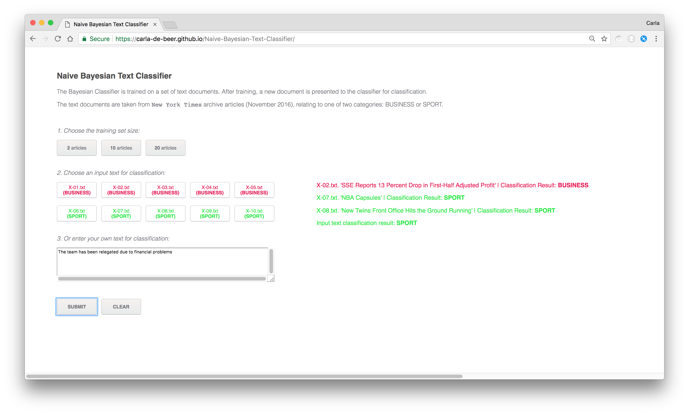

# Naive-Bayesian-Text-Classifier

A naive Bayesian text classifier that classifies input text into one of two categories: either a BUSINESS article or a SPORT article.

Train on any of the given training sets, and then test by either using one of the provided validation texts, or input your own text into the text field provided.

Built with P5js and RequireJS.

To view this project, navigate to: https://carla-de-beer.github.io/Naive-Bayesian-Text-Classifier/

  

